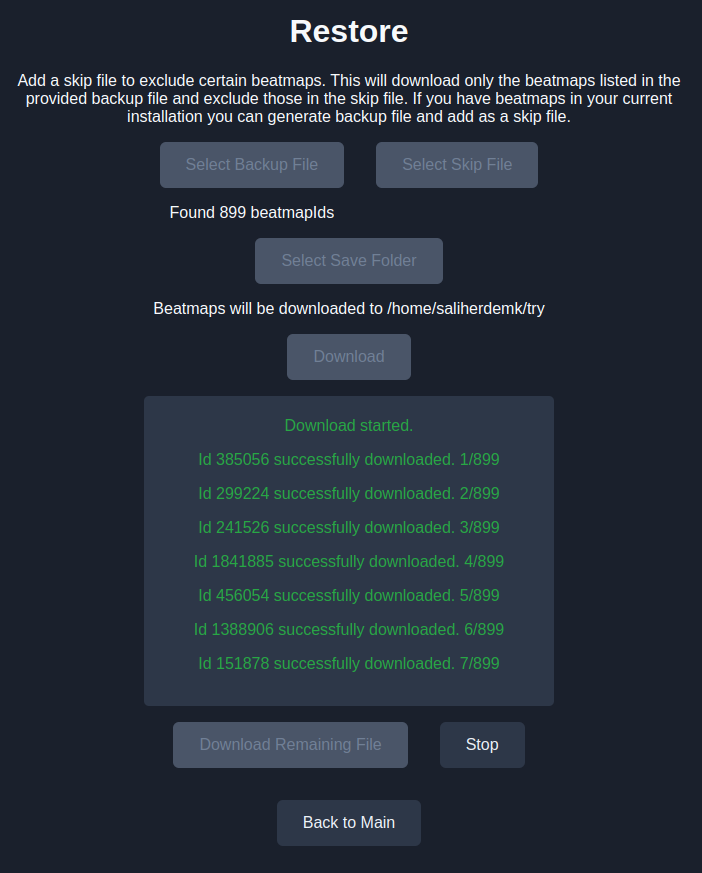

# Osu-lazer Backup

A very simple app to back up your beatmaps into a single JSON file and then download all your maps automatically. The goal is to store your beatmaps as a very small JSON file that you can save anywhere, such as in a Discord message, and restore all your beatmaps if needed. The app can also compare two backup files and download any beatmaps you don't already have.

## What does it do
It looks `client.realm` file from your installation and fetches all of your beatmapSetId's from there. Then it writes into a json file. 

In restore, it iterates over provided file and downloads beatmaps using [mino api](https://catboy.best/).

## ScreenShot

## Installation
### Linux (Arch)
1. `git clone https://github.com/rvndsy/osu-lazer-backup.git`
2. `cd osu-lazer-backup`
3. Set up npm:
    1. `npm init -y`
    2. `npm install electron`
4. Install `electron` browser
    - Arch: `sudo pacman -S electron`
5. Run with `electron main.js`
